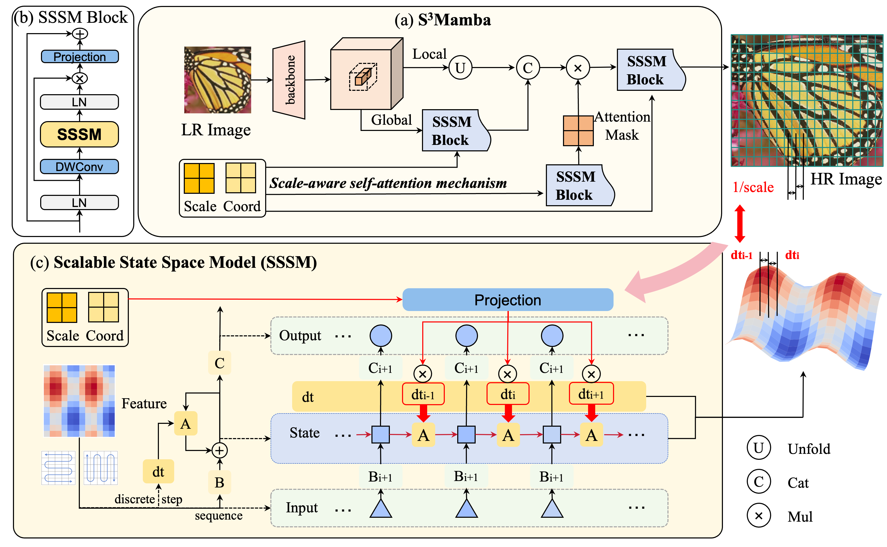

# S<sup>3</sup>Mamba: Arbitrary-Scale Super-Resolution via Scaleable State Space Model

[]([https://arxiv.org/abs/2408.11758](https://arxiv.org/abs/2405.07023))  []() 

## :bookmark: News!!!
- [x] 2024-****: **Arxiv Version has been released.**
- [ ] The code will be released soon.


## Abstract

Arbitrary scale super-resolution (ASSR) aims to super-resolve low-resolution images to high-resolution images at any scale using a single model, addressing the limitations of traditional super-resolution methods that are restricted to fixed-scale factors (e.g., ×2, ×4). The advent of Implicit Neural Representations (INR) has brought forth a plethora of novel methodologies for ASSR, which facilitate the reconstruction of original continuous signals by modeling a continuous representation space for coordinates and pixel values, thereby enabling arbitrary-scale super-resolution. Consequently, the primary objective of ASSR is to construct a continuous representation space derived from low-resolution inputs. However, existing methods, primarily based on CNNs and Transformers, face significant challenges such as high computational complexity and inadequate modeling of long-range dependencies, which hinder their effectiveness in real-world applications. To overcome these limitations, we propose a novel arbitrary-scale super-resolution method, called S<sup>3</sup>Mamba, to construct a scalable continuous representation space. Specifically, we propose a Scalable State Space Model (SSSM) to modulate the state transition matrix and the sampling matrix of step size during the discretization process, achieving scalable and continuous representation modeling with linear computational complexity. Additionally, we propose a novel scale-aware self-attention mechanism to further enhance the network's ability to perceive global important features at different scales, thereby building the S<sup>3</sup>Mamba to achieve superior arbitrary-scale super-resolution. Extensive experiments on both synthetic and real-world benchmarks demonstrate that our method achieves state-of-the-art performance and superior generalization capabilities at arbitrary super-resolution scales. The code will be publicly available.
## Framework



## :sparkles: Getting Start

### Prepare environment


## Cite US
Please cite us if this work is helpful to you.

```

}
```

## Acknowledgments
The basic code is partially from the below repos.
- [BasicSR]([link](https://github.com/XPixelGroup/BasicSR))
